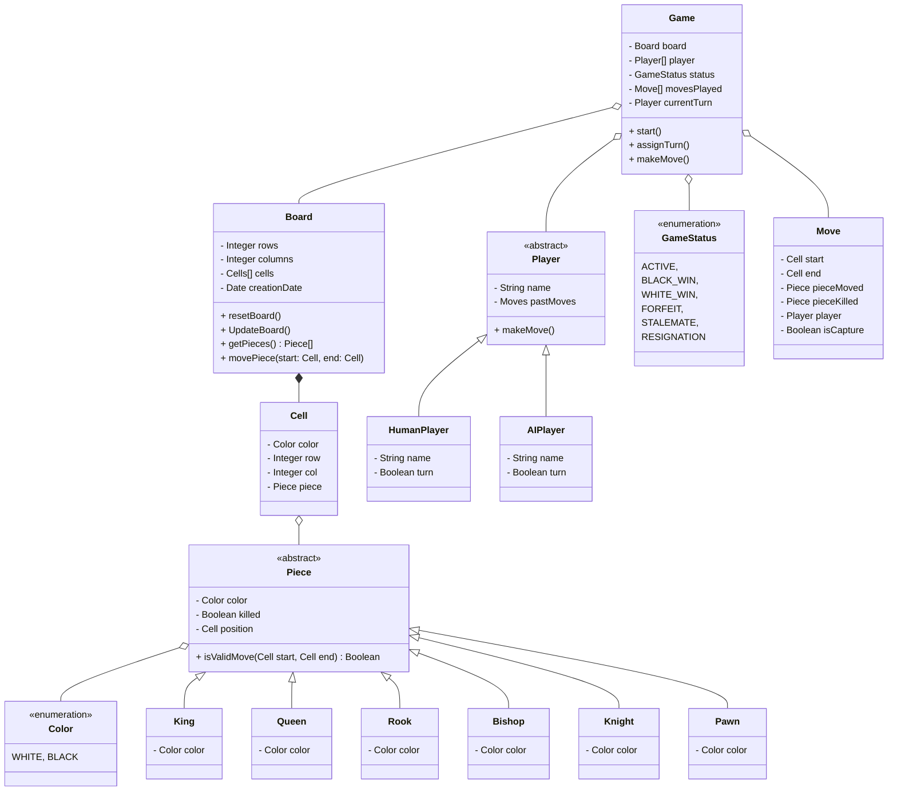

# Design a Chess Game

## Requirements

### Core Game Setup

	1.	The game consists of:
	    •	A Chess Board with an 8x8 grid.
	    •	Chess Pieces of two colors: White and Black.
	    •	Two Players, who can be Human vs. Human or Human vs. AI.
	2.	Piece Setup: Each player has 16 pieces initially—eight pawns, two bishops, two knights, two rooks, one queen, and one king.
	3.	Piece Types:
        •	King: Moves one square in any direction.
        •	Queen: Moves any number of squares diagonally, horizontally, or vertically.
        •	Rook: Moves any number of squares horizontally or vertically.
        •	Bishop: Moves any number of squares diagonally.
        •	Knight: Moves in an ‘L-shape,’ two squares in one direction and one square perpendicular.
        • Pawn
	    

### Gameplay Rules

	4.	Game Start:
        •	Each player is randomly assigned a color.
        •	The player with white pieces starts the game.
	5.	Turns:
        •	Players take turns, moving one piece at a time.
        •	The system enforces turn-based play, allowing only one move per player at a time.
	6.	Move Restrictions:
        •	Moves must be valid per the rules of chess.
        •	A player cannot retract or undo a move once it has been made.
        •	The system will validate moves to ensure no rule violations (e.g., a king cannot move into check).
	7.	Move Tracking:
	    •	The system keeps a record of all moves made by each player.

### Game End Conditions

	8.	Winning Condition: The objective is to checkmate the opponent’s king.
	9.	Draw Conditions:
        •	Stalemate: When the player to move has no legal moves but is not in check.
        •	Insufficient Material: When neither player has enough pieces to checkmate.
        •	50-Move Rule: If 50 moves pass without a pawn move or capture, the game is a draw.
        •	Threefold Repetition: If the same board position repeats three times with the same player to move, the game is a draw.
	10.	Other Endings:
        •	A player can resign to concede the game.
        •	Forfeiture if a player exceeds a time limit (if time controls are added in future versions).

### Additional Features (Optional)

    11.	AI Player: When selected, the AI opponent should make valid moves, potentially  with configurable difficulty levels in future expansions.
	12.	Time Controls (Future Scope): Optionally enforce time limits per move or overall game duration.

## Class Diagram

